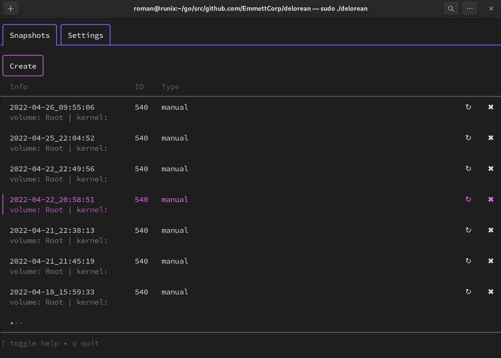

WIP
---

# DeLorean 

## What is DeLorean.

DeLorean is a btrfs manager. It allows you to create, list, delete snapshots for any btrfs subvolumes on your system (even hot pluggable devices).

Delorean doesn't force you to name your subvolume specifically. You can choose any name you want.

Delorean helps managing snapshots of any mounted btrfs subvolume.

Delorean allows you to rollback subvolumes, that are children of the top level subvolume, using ui. Check [Flat layout](https://btrfs.wiki.kernel.org/index.php/SysadminGuide#Flat) from btrfs wiki.

## Features

- cli-ui
- mouse support
- support snapshots managing for hot pluggable devices 
- easy to rollback any child subvolume of top level

## UI

## Customization

You can slightly customize the appearance. There could be the background that hides the fonts or inappropriate to highlight.
So there are only two fields you can customize: font color (by default it is taken from the default, so I guess it could be seldom case) and highlight background (it looks like more often candidate to change).

You can set needed color in config, like:

    {
        ...
        "colors": {
            "foreground": "",
            "highlight": "cyan"
        }
    }

Available values, according to color attributes in [this package](https://github.com/jroimartin/gocui/blob/master/attribute.go):

- black
- white
- blue
- green
- magenta
- red
- yellow
- cyan

## Requirements

- linux
- btrfs

## Installation

- Download archive from Releases
- Extract archive

    sudo mv delorean /urs/local/bin

## Alternatives

There are mature and awesome tools that help you to manage btrfs as well but with different from delorean approach.

Each of them (delorean as well) has it's own restrictions and advantages. Choose more appropriate to your cases.

[Timeshift](https://github.com/teejee2008/timeshift)

[snapper](https://github.com/openSUSE/snapper) 