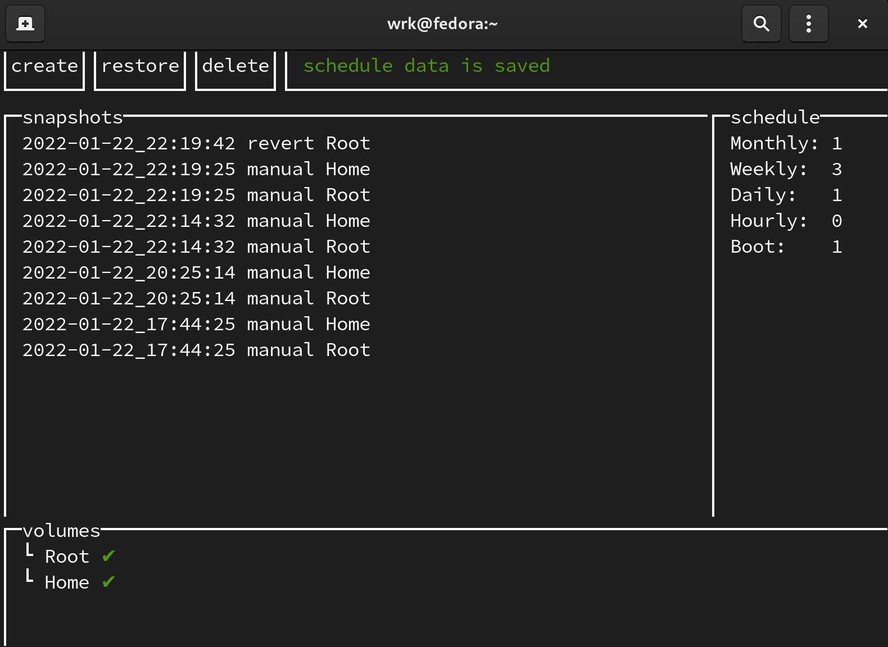

WIP
---

# DeLorean 

## What is DeLorean.

DeLorean is a btrfs manager. It allows you to create, list, delete snapshots for any btrfs subvolumes on your system (even hot pluggable devices).

Delorean doesn't force you to name your subvolume specifically. You can choose any name you want.

Delorean helps managing snapshots of any mounted btrfs subvolume.

Delorean allows to rollback subvolumes, that are children of the top level subvolume, using ui. Check [Flat layout](https://btrfs.wiki.kernel.org/index.php/SysadminGuide#Flat) from btrfs wiki.

## UI

